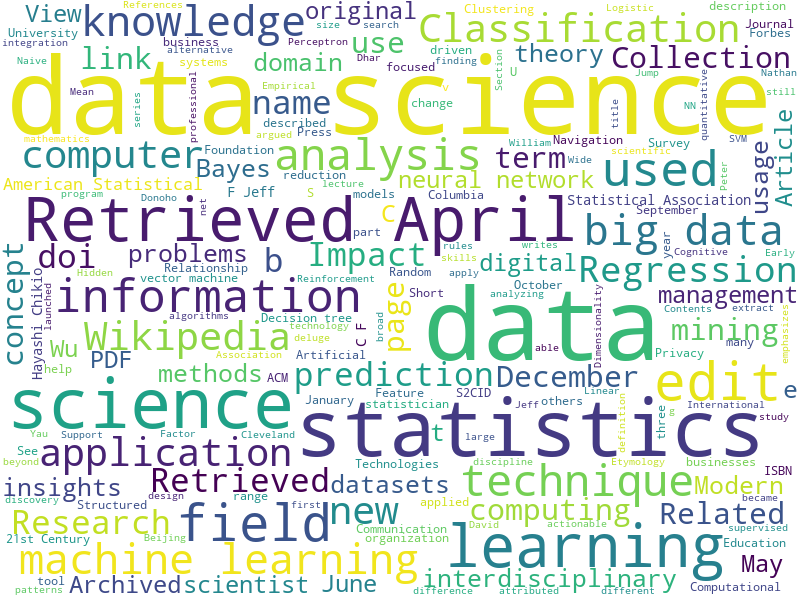

Im diesem Workshop machen wir erste Gehversuche mit Python, spielen mit der Technik und malen eine Wolke.


### 🚀 Challenge #1: Python starten

Studieren Sie Anleitungen für Anaconda und Python - hier oder in beliebigen Tutorials online. 

**Aufgabe:** Installieren Sie Python auf Ihrem Zielsystem, vorzugsweise via Anaconda. Legen Sie ein Einvironment an auf Basis von python 3.10 an, aktivieren Sie das Environment und installieren Sie dort Jupyter Notebook. 


```
# Erstelle ein neues Conda-Environment, z.B. mit Python 3.10
conda create --name mein_environment python=3.10

# Aktiviere das neu erstellte Environment
conda activate mein_environment

# Installiere Jupyter Notebook im aktiven Environment
conda install jupyter
```
Anmerkung: die konkrete Python-Version ist hier und heute relativ egal, hauptsache es ist etwas halbwegs aktuelles.

Starten Sie Jupyter:


```
jupyter notebook
```

### 🚀 Challenge #2: Jupyter beherrschen

**Aufgabe:** Laden Sie sich [`notebook.ipynb`](notebook.ipynb) herunter, öffnen Sie das Notebook auf Ihrem Rechner mit Jupyter und studieren Sie den Code. Nutzen Sie die Anweisungen im Notebook, um eine Word Cloud wie im folgenden Bild zu erstellen. Verwenden Sie als Eingabe die Wikipedia-Artikel zu <em>Big Data</em> und <em>Machine Learning</em>.




**Hinweis:** Vermutlich wird das Notebook nicht sofort "einfach so" funktionieren. Gehen Sie den Fehlern nach und fixen Sie die Probleme...


### 🚀 Challenge #3: Daten verstehen

**Aufgabe:** Interpretieren Sie "Ihre" Wolke. Versuchen Sie, die deutsche Wikipedia durch eine Wikipedia-Seite in einer anderen Sprache Ihrer Wahl zu ersetzen. Engagieren Sie sich als Data Scientist und vergleichen Sie die Bilder - gibt es interessante Auffälligkeiten? Setzen andere Sprachen andere Schwerpunkte? Was können Sie aus dieser einfachen Analyse über die _Wissensbasis_ Wikipedia lernen?


### 🚀 Challenge #4: Wissensbasis

**Aufgabe:** Was ist eigentlich eine Wissensbasis? Versuchen Sie, eine vorlesungs-taugliche Definition zu finden. Sammeln Sie an der Wand im Raum Beispiele für spannende Wissensbasen. Passen Sie ggf. Ihre Definition an, damit die Definition die gefundenen Beispiele gut strukturiert.
